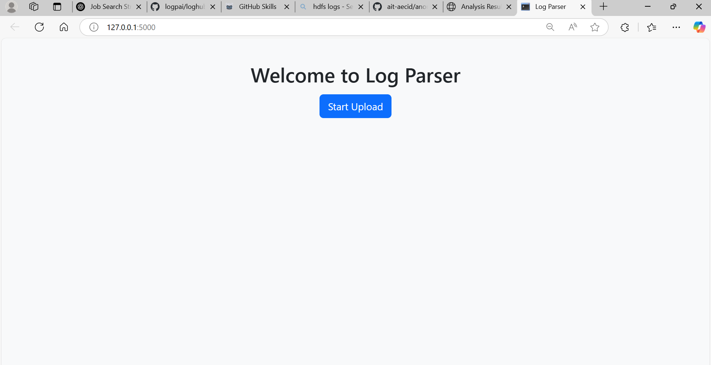
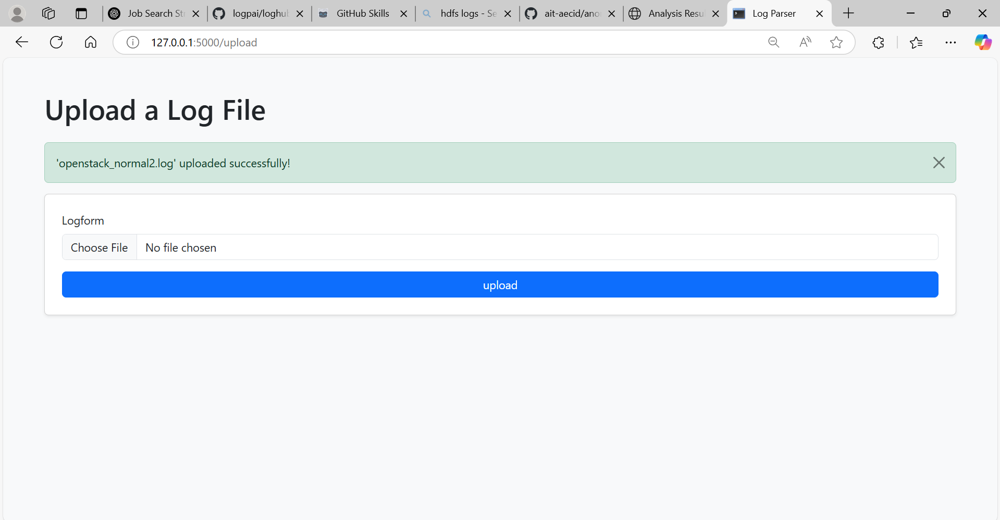
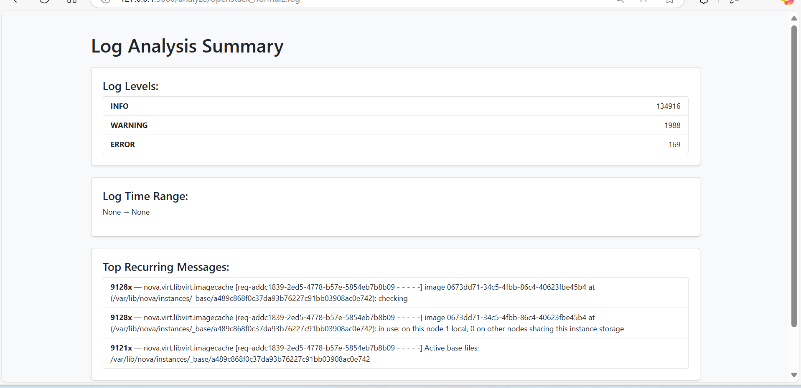

# 🛠️ Log Parser + Issue Identifier

A smart, Flask-based web application that analyzes log files, detects recurring issues, extracts log level summaries, and displays time range insights. Built for Automation Engineers and Support Teams to quickly understand large-scale system logs.

---

## 🔍 Features

- 📤 Upload `.log` files through a simple UI
- 📊 Summarizes counts of `INFO`, `WARNING`, and `ERROR` messages
- 🧠 Detects recurring issues (groups similar log messages)
- 🕒 Displays time range from the log timestamps
- 📥 Download log summaries as CSV
- 💡 Flash alerts for file status and errors
- 🎨 Clean Bootstrap 5 UI

---

## 📸 Screenshots

### 🔹 Welcome page

### 🔹 Upload Page

### 🔹 Parsed Summary

## 🚀 Getting Started

### 1. Clone the repo

git clone https://github.com/yourusername/log-parser.git
cd log-parser

### 📦 Tech Stack
Python 3.11

Flask

WTForms

Bootstrap 5 (via CDN)

Jinja2

CSV / datetime / regex

## 📃 License
This project is open source and available under the MIT License.